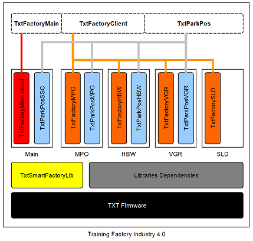
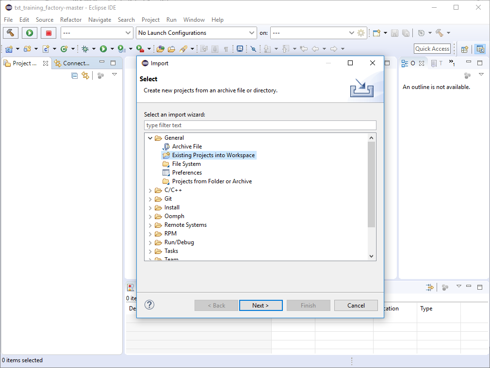
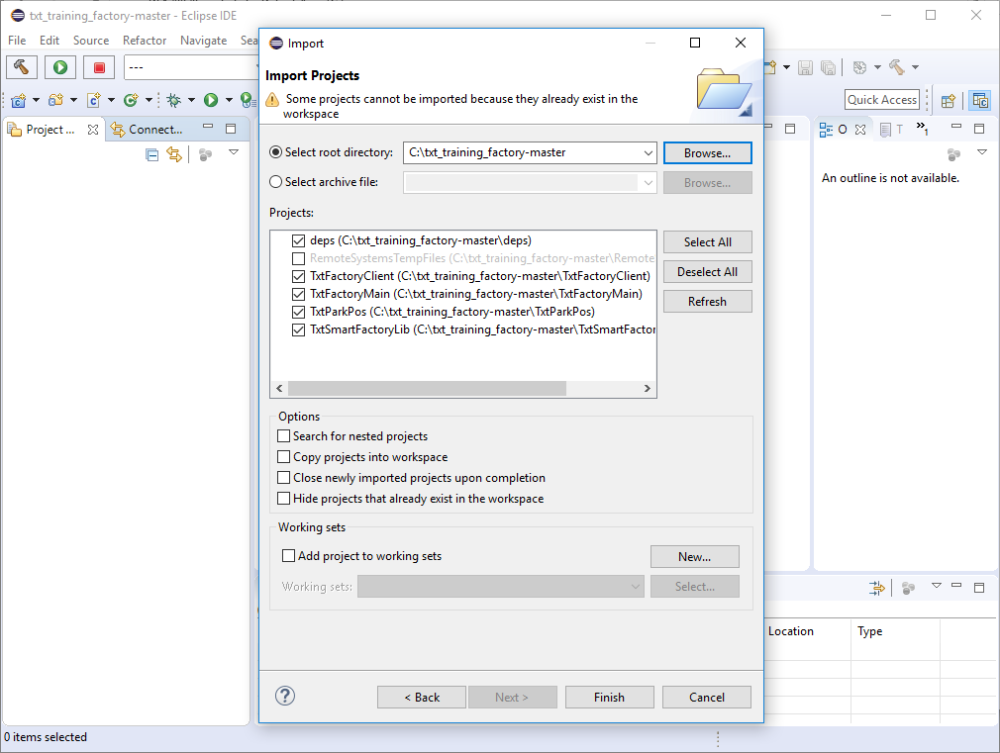
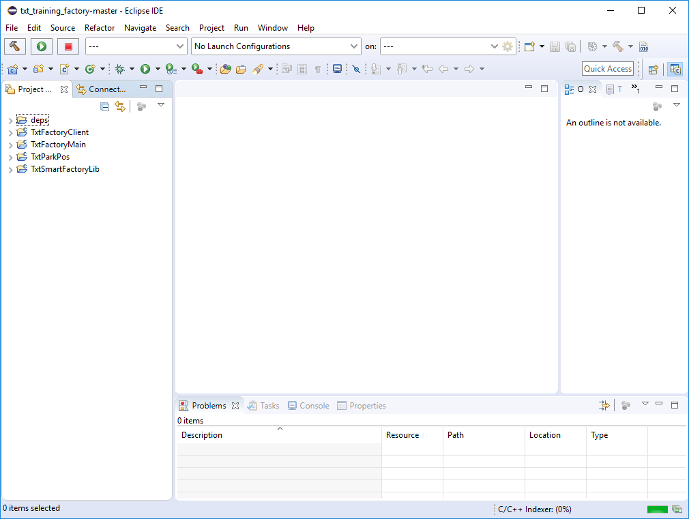
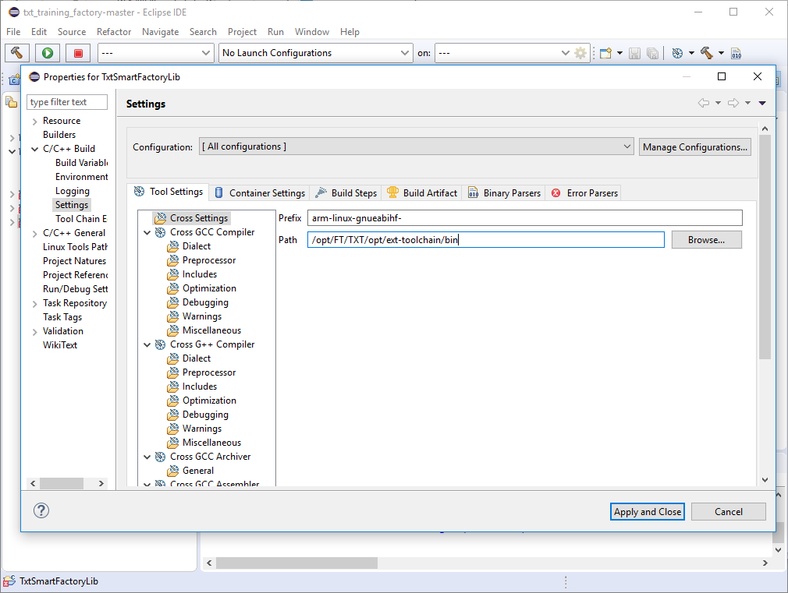
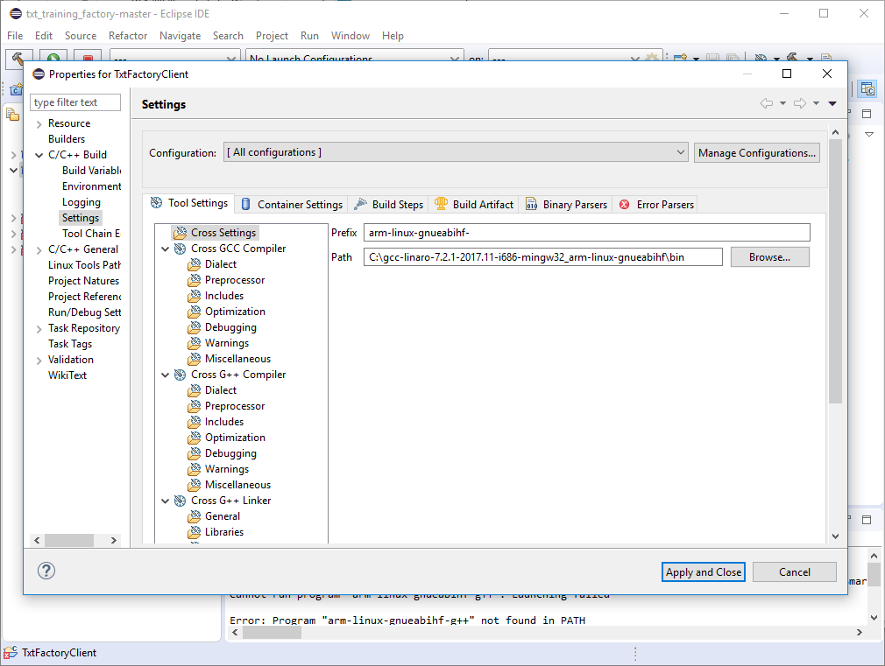

# IDE Setup

The following diagram shows the structure of the eclipse workspace.

## 1. TXT Tool Chain
Download and extract the TXT Tool Chain for [Linux](https://github.com/fischertechnik/txt_training_factory/releases/download/v0.7.0/gcc-linaro-7.2.1-2017.11-x86_64_arm-linux-gnueabihf.tar.xz) or [Windows](https://github.com/fischertechnik/txt_training_factory/releases/download/v0.7.0/gcc-linaro-7.2.1-2017.11-i686-mingw32_arm-linux-gnueabihf.tar.xz)

## 2. Import txt_traning_factory
Download [txt_traning_factory](https://github.com/fischertechnik/txt_training_factory/archive/master.zip), extract and import the workspace in [eclipse CDT](https://www.eclipse.org/cdt/downloads.php) as `General -> Existing Projects into Workspace`

## 3. Config txt_traning_factory
Change the paths in the properties for all projects in `Properties -> C/C++ Build -> Settings -> Cross Settings -> Path` to the TXT Tool Chain path. Select `[All configurations]` and repeat for all subprojects.

## 4. Build
Build all projects
